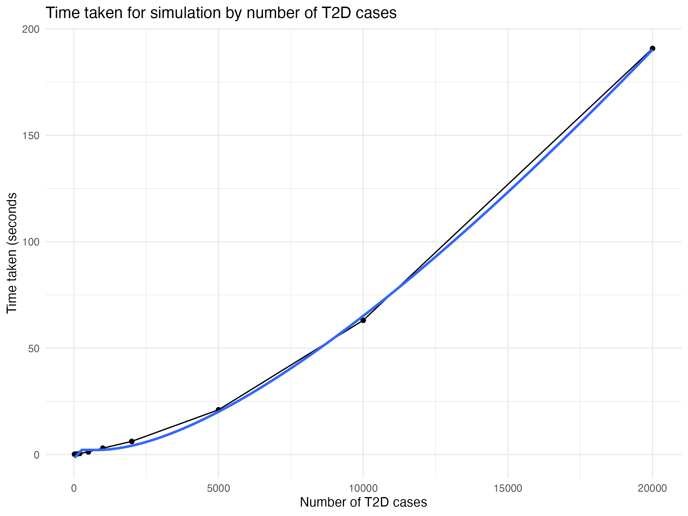
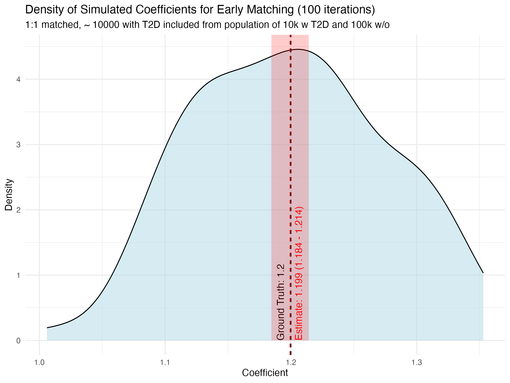
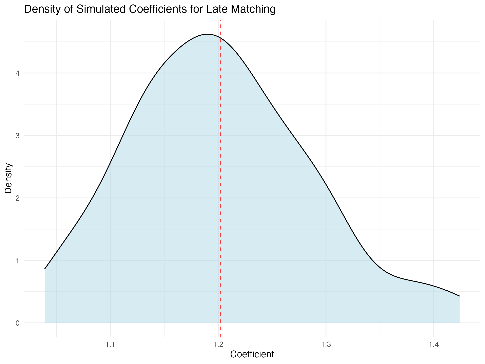

# Simulation to evaluate the correct time-zero for matching and follow-up in a matched cohort study 

  \
  \
  \

# Load libraries
```{r}
library(tidyverse)
library(furrr)
library(progressr)
library(tictoc)
```

Set seed for reproducibility
```{r}
set.seed(123) 
```

# Create function to simulate data
```{r}
simulate_data <- function(n_t2d = 10000, n_non_t2d = 100000,
                          start_date = as.Date('2012-01-01'), 
                          end_date = as.Date('2024-12-31'),
                          death_rate = 3/1000, aid_rate = 1/100,
                          death_IRR = 1.5, aid_IRR = 1.2,
                          min_age = 18) {
  n_t2d <- (10000/7221.613 * n_t2d) |> round()
  n <- n_t2d + n_non_t2d
  data <- tibble(
    end_of_study = end_date,
    id = 1:n,
    sex = rbinom(n, 1, 0.5), # Random sex
    T2D_diagnosis_date = c(
        sample(seq(start_date, end_date, by="day"), n_t2d, replace = T), 
        rep(NA, n_non_t2d)
    ), # Uniform random T2D diagnosis dates for T2D group, NA for non-T2D group
    high_risk = rbinom(n, 1, 0.3 + 0.15 * !is.na(T2D_diagnosis_date)), # Random high-risk status
    birth_date = c(
        T2D_diagnosis_date[1:n_t2d] - 44*365.25 - (rexp(n_t2d, rate = 1) |> (\(x) x / max(x) * 26 * 365.25)()), # Random birth dates for T2D group with exponentially distributed age at diagnosis after age 44, scaled to a maximum of 26 years
        sample(seq(as.Date('1950-01-01'), as.Date('1979-12-31'), by="day"), n_non_t2d, replace=T)
    ), # Uniform random birth dates
    
    AID_date = birth_date + 20*365.25 + rexp(n, rate = aid_rate * 1.5^high_risk) * 365.25, # Time to AID diagnosis follows an exponential distribution
    death_date = birth_date + 50*365.25 + rexp(n, rate = death_rate * 1.5^high_risk) * 365.25 # Time to death follows an exponential distribution
  ) |>
  mutate(
    T2D_diagnosis_date = case_when(
      !is.na(T2D_diagnosis_date) & T2D_diagnosis_date >= pmin(AID_date, death_date, end_of_study, na.rm =T) ~ NA,
      TRUE ~ T2D_diagnosis_date
    )
  ) |>
  mutate(
    death_date = case_when(
            !is.na(T2D_diagnosis_date) ~ T2D_diagnosis_date + rexp(n(), rate = death_IRR * death_rate  * 1.5^high_risk) * 365.25,
            TRUE ~ death_date
    ),

    AID_date = case_when(
            !is.na(T2D_diagnosis_date) ~ T2D_diagnosis_date + rexp(n(), rate = aid_IRR * aid_rate * 1.5^high_risk) * 365.25,
            TRUE ~ AID_date
    )
  ) |>
  filter(
    is.na(T2D_diagnosis_date) | T2D_diagnosis_date > birth_date + min_age*365.25
  ) |>
    mutate(
        AID_date = case_when(
            AID_date >= death_date ~ NA,
            AID_date > end_of_study ~ NA,
            TRUE ~ AID_date
        ),
        death_date = case_when( 
            death_date > end_of_study ~ NA,
            TRUE ~ death_date
        ),
        first_event_date = pmin(AID_date, death_date, end_of_study, na.rm = TRUE),
        event = case_when(
            !is.na(AID_date) & AID_date == first_event_date ~ 1,
            !is.na(death_date) & death_date == first_event_date ~ 2,
            TRUE ~ 0
        )
    )

  data
}

```

# Create function to perform matching and compute time to event / outcome status
```{r}
perform_matching <- function(df, match_ratio = 1, 
                             post_matching_quarantine = 365.25/2, 
                             match_time_delay = 0,
                             fu_start_delay = 365.25/2) {
  
  df <- df |> mutate(birth_year = as.numeric(format(birth_date, "%Y")))
  
  t2d_group <- df |>
  filter(!is.na(T2D_diagnosis_date)) |>
  filter(
    T2D_diagnosis_date < pmin(AID_date, death_date, end_of_study, na.rm = T) - post_matching_quarantine
  ) |> 
  mutate(match_group = row_number())

  #control_group <- df |> filter(is.na(T2D_diagnosis_date))

  controls <- t2d_group |>
    rowwise() |>
    mutate(
      matched_controls = list({
        t2d_sex         <- .data$sex
        #t2d_birth_year  <- .data$birth_year
        t2d_match_group <- .data$match_group
        t2d_birth_date  <- .data$birth_date
        matching_date  <- .data$T2D_diagnosis_date + match_time_delay


        control_ids <- df |>
          filter(
            sex == t2d_sex,
            birth_date |> between(t2d_birth_date - 365.25, t2d_birth_date + 365.25),
            first_event_date > matching_date + post_matching_quarantine,
            is.na(T2D_diagnosis_date) | T2D_diagnosis_date > matching_date + post_matching_quarantine
          ) |>
          mutate(diff_birth = {
            first_event_date = pmin(first_event_date, T2D_diagnosis_date)
            abs(as.numeric(birth_date - t2d_birth_date))
          }) |>
          arrange(diff_birth) |>          
          slice_sample(n = match_ratio) |>
          pull(id)

          cat(sprintf("\rProgress: %d/%d = %.3f%%", t2d_match_group, nrow(t2d_group), 100*t2d_match_group / nrow(t2d_group)))  # Print the number of potential matches for debugging

        control_ids
      })
    ) |>
    ungroup() |> 
    select(match_group, matched_controls) |>
    unnest(matched_controls) |>  
    mutate(matched_controls = unlist(matched_controls)) |>
    left_join(df, by = c("matched_controls" = "id")) |>
    rename(id = matched_controls)

  matched_data <- t2d_group |>
    bind_rows(controls) |>
    arrange(match_group, id) |>
    group_by(match_group) |>
    mutate(
      matching_date = t2d_group$T2D_diagnosis_date[match_group] + match_time_delay,
      tte = difftime(first_event_date, matching_date + fu_start_delay, units = "days") |> as.numeric()
    ) |> 
    filter(n() > 1) |>
    ungroup()

  matched_data
}
```

# Create function to fit Poisson regression and extract coefficient
```{r}
get_coef <- function(df) {
  poisson_res <- glm(event == 1 ~ !is.na(T2D_diagnosis_date), family = poisson, offset = log(tte |> as.numeric()), data = df)
  poisson_res$coefficients[2] |> exp() |> round(3)
}
```

# Create function to run the entire simulation process
```{r}
handlers(handler_progress())

run_all <- function(replication_no = 1, n_t2d = 20000, n_non_t2d = 200000, 
                    match_ratio = 1, post_matching_quarantine = 365.25/2, match_time_delay = 0, fu_start_delay = 365.25/2, prog = NULL) {
  tic()
  #cat("\nReplication no.: ", replication_no, "\n")
  df <- simulate_data(n_t2d, n_non_t2d)
  matched_df <- perform_matching(df, match_ratio, post_matching_quarantine = post_matching_quarantine, match_time_delay = match_time_delay, fu_start_delay = fu_start_delay)
  if (!is.null(prog)) prog(sprintf(": Worker number %d finished (total %d workers). Note: completions are not ordered", replication_no, iterations))
  toc()
  get_coef(matched_df)
}
```

# Run a single replication
```{r}
#| eval: false

run_all(n_t2d = 10000, n_non_t2d = 100000)
run_all(n_t2d = 10000, n_non_t2d = 100000, match_ratio = 1, post_matching_quarantine = 365.25/2, match_time_delay = 0, fu_start_delay = 0)
```

# Time complexity test: Run repeated simulations and measure time taken for different numbers of T2D cases
```{r}
#| eval: false

timed <- function(n, n2 = NULL) {
  if (is.null(n2)) n2 <- n * 10
  tic()
  run_all(n_t2d = n, n_non_t2d = n2, match_ratio = 1, post_matching_quarantine = 365.25/2, match_time_delay = 0)
  cat("\n")
  z <- toc()
  time <- list()
  time[as.character(n)] <- as.numeric(z$toc - z$tic)
  time
}

times <- lapply(c(20, 50, 100, 200, 500, 1000, 2000, 5000, 10000, 20000), timed)
time_complexity <- times |> 
  unlist() |>
  enframe(name = "n_t2d", value = "time_seconds") |>
  mutate(n_t2d = as.numeric(n_t2d)) |>
  ggplot(aes(x = n_t2d, y = time_seconds)) +
  geom_line() +
  geom_point() +
  labs(title = "Time taken for simulation by number of T2D cases",
       x = "Number of T2D cases",
       y = "Time taken (seconds)") +
  theme_minimal() + 
  geom_smooth(aes(x = n_t2d, y = time_seconds), formula = y ~ x * log(x), method = "lm", se = FALSE) #linear regression line
time_complexity
```



# Parallelize the simulation using furrr
```{r}
#| eval: false

plan(multisession)
iterations <- 100
n_t2d <- 10000
n_non_t2d <- 100000

with_progress({
  tic()
  p <- progressor(iterations)
  iterate_sim_early_match <- future_map(
    1:iterations, run_all, 
    n_t2d = n_t2d, n_non_t2d = n_non_t2d, match_ratio = 1, post_matching_quarantine = 365.25/2, match_time_delay = 0, prog = p,
    .options = furrr_options(seed = TRUE, chunk_size = 1)
  )
  toc()
})

with_progress({
  tic()
  p <- progressor(iterations)
  iterate_sim_late_match <- future_map(
    1:iterations, run_all,
    n_t2d = n_t2d, n_non_t2d = n_non_t2d, match_ratio = 1, post_matching_quarantine = 0, match_time_delay = 365.25/2, prog = p,
    .options = furrr_options(seed = TRUE, chunk_size = 1)
  )
  toc()
})

```

# Compute mean and sd of coefficients for early and late matching
```{r}
#| eval: false

iterate_sim_early_match |> unlist() |> (\(x) c(mean = mean(x) |> round(3), sd = sd(x) |> round(3), se = (sd(x)/sqrt(length(x))) |> round(3), conf.int = sprintf("%.3f - %.3f", mean(x) - 1.96 * sd(x)/sqrt(length(x)), mean(x) + 1.96 * sd(x)/sqrt(length(x)))))()
iterate_sim_late_match |> unlist() |> (\(x) c(mean = mean(x) |> round(3), sd = sd(x) |> round(3), se = (sd(x)/sqrt(length(x))) |> round(3), conf.int = sprintf("%.3f - %.3f", mean(x) - 1.96 * sd(x)/sqrt(length(x)), mean(x) + 1.96 * sd(x)/sqrt(length(x)))))()
```

# Create function to plot distribution of coefficients
```{r}
plot_density <- function(list, title = "Density of Simulated Coefficients") {
  df <- tibble(coef = list |> unlist())
  
    ci_df <- data.frame(
    xmin = mean(unlist(list)) - 1.96 * sd(unlist(list)) / sqrt(length(unlist(list))),
    xmax = mean(unlist(list)) + 1.96 * sd(unlist(list)) / sqrt(length(unlist(list)))
    )

  ggplot(df, aes(x = coef)) +
    geom_density(fill = "lightblue", alpha = 0.5) +
    geom_vline(xintercept = mean(list |> unlist()), color = "red", linetype = "dashed") +
    labs(title = title, subtitle = sprintf("1:1 matched, ~ %d with T2D included from population of %dk w T2D and %dk w/o", n_t2d, n_t2d/1000, n_non_t2d/1000),
         x = "Coefficient",
         y = "Density") +
    theme_minimal() + 
    geom_vline(xintercept = 1.2, color = "black", linetype = "dashed") + # ground truth line at 1.2 for AID
    annotate("text", x = 1.2, y = 0, label = "Ground Truth: 1.2", color = "black", vjust = -1, hjust = 0, angle = 90) + # Add text annotation for ground truth
    annotate("text", x = (mean(list |> unlist()) + 0.015), y = 0, label = sprintf("Estimate: %.3f (%.3f - %.3f)", mean(list |> unlist()), mean(list |> unlist()) - 1.96 * sd(list |> unlist())/sqrt(length(list |> unlist())), mean(list |> unlist()) + 1.96 * sd(list |> unlist())/sqrt(length(list |> unlist()))), color = "red", vjust = -1, hjust = 0, angle = 90) + # Add text annotation for mean coefficient
    # add confidence band around the mean coefficient
    geom_rect(data = ci_df, aes(xmin = xmin, xmax = xmax, ymin = 0, ymax = Inf), fill = "red", alpha = 0.2, inherit.aes = FALSE)
}
```

# Plot empirical coefficient density for different matching strategies
```{r}
#| eval: false

d1 <- plot_density(iterate_sim_early_match, title = sprintf("Density of Simulated Coefficients for Early Matching (%d iterations)", iterations))
d2 <- plot_density(iterate_sim_late_match, title = sprintf("Density of Simulated Coefficients for Late Matching (%d iterations)", iterations))


d1
d2
```





# Save plots to files
```{r}
#| eval: false

ggsave("cohort_matching/1. density_early_matching.png", plot = d1, width = 8, height = 6)
ggsave("cohort_matching/2. density_late_matching.png", plot = d2, width = 8, height = 6)

ggsave("cohort_matching/3. time_complexity.png", plot = time_complexity, width = 8, height = 6)
```
